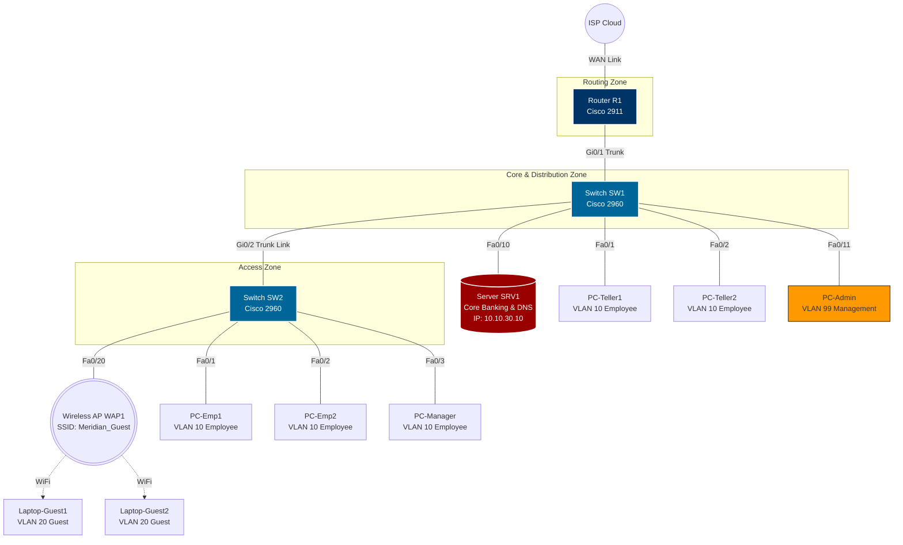

# SmartBranch 360 Network Design Document

## 1. Executive Summary
Meridian Trust Bank is opening a new regional retail branch. To ensure secure, scalable, and compliant operations, the branch network is designed with strict segmentation using Virtual Local Area Networks (VLANs), robust Access Control Lists (ACLs) to protect server environments, and secured administration access. This document details the exact configuration and physical/logical topology required to construct the network in Cisco Packet Tracer.

---

## 2. Topology Description

The branch network consists of:
- **1x Router (R1):** Cisco 2911 Router. Configured for Router-on-a-Stick (RoaS) inter-VLAN routing, DHCP services, NAT overload, and ACL enforcement.
- **2x Switches (SW1 & SW2):** Cisco Catalyst 2960-24TT Switches. SW1 acts as the distribution/core switch for local office resources, while SW2 acts as the access switch for the lobby and additional office zones.
- **1x Wireless Access Point (WAP1):** Linksys Home Gateway or Generic AP, providing SSID `"Meridian_Guest"` mapped directly to VLAN 20.
- **1x Internal Branch Server (SRV1):** Hosted on VLAN 30, running core banking apps, file shares, and DNS services.
- **1x Internet/Cloud connection:** Simulates ISP WAN uplink from Router R1's `GigabitEthernet0/0` interface.
- **8x Endpoints:** Wired teller systems, employee computers, guest laptops, and a dedicated network administrator workstation.

### Physical Cable Connections (Port Map)

| Source Device | Source Port | Destination Device | Destination Port | Cable Type | VLAN Mode / Assignment |
| :--- | :--- | :--- | :--- | :--- | :--- |
| **R1** | `Gi0/0` | **ISP-Cloud** | `Gi0/0` | Copper Straight-Through | WAN / IP via DHCP (or public IP) |
| **R1** | `Gi0/1` | **SW1** | `Gi0/1` | Copper Straight-Through | Trunk (802.1Q Allowed: 10,20,30,99) |
| **SW1** | `Gi0/2` | **SW2** | `Gi0/2` | Copper Cross-Over | Trunk (802.1Q Allowed: 10,20,30,99) |
| **SW1** | `Fa0/1` | **PC-Teller1** | `FastEthernet0` | Copper Straight-Through | Access (VLAN 10 Employee) |
| **SW1** | `Fa0/2` | **PC-Teller2** | `FastEthernet0` | Copper Straight-Through | Access (VLAN 10 Employee) |
| **SW1** | `Fa0/10` | **SRV1** | `FastEthernet0` | Copper Straight-Through | Access (VLAN 30 Server) |
| **SW1** | `Fa0/11` | **PC-Admin** | `FastEthernet0` | Copper Straight-Through | Access (VLAN 99 Management) |
| **SW2** | `Fa0/1` | **PC-Emp1** | `FastEthernet0` | Copper Straight-Through | Access (VLAN 10 Employee) |
| **SW2** | `Fa0/2` | **PC-Emp2** | `FastEthernet0` | Copper Straight-Through | Access (VLAN 10 Employee) |
| **SW2** | `Fa0/3` | **PC-Manager** | `FastEthernet0` | Copper Straight-Through | Access (VLAN 10 Employee) |
| **SW2** | `Fa0/20` | **WAP1** | `Port 0` | Copper Straight-Through | Access (VLAN 20 Guest) |

---

## 3. Network Topology Diagram

The diagram below outlines the physical and logical structure of the branch network:



---

## 4. VLAN and IP Addressing Table

| VLAN ID | VLAN Name | Subnet | Gateway IP | Subnet Mask | DHCP Range | Primary DNS | Description |
| :--- | :--- | :--- | :--- | :--- | :--- | :--- | :--- |
| **10** | Employee | `10.10.10.0/24` | `10.10.10.1` | `255.255.255.0` | `10.10.10.10 - .250` | `10.10.30.10` | Wired teller systems & office employees |
| **20** | Guest | `10.10.20.0/24` | `10.10.20.1` | `255.255.255.0` | `10.10.20.10 - .250` | `10.10.30.10` | Lobby guest Wi-Fi internet access only |
| **30** | Server | `10.10.30.0/24` | `10.10.30.1` | `255.255.255.0` | None (Static Only) | `10.10.30.10` | Core banking application and DNS server |
| **99** | Management | `10.10.99.0/24` | `10.10.99.1` | `255.255.255.0` | `10.10.99.10 - .50` | `10.10.30.10` | Network device management SVIs / IT PC |

---

## 5. Security Rules & Enforcement

To maintain compliance and protect customer financial data, the network enforces strict isolation between Guest clients and internal servers, and restricts administration access.

### Security Rules Summary

| Rule ID | Objective | Enforcement Point | Plain English Logic | Cisco IOS ACL Implementation Detail |
| :--- | :--- | :--- | :--- | :--- |
| **SEC-01** | Guest-to-Server Isolation | Router R1 (Inbound on sub-interface `Gi0/1.20`) | Blocks any traffic from Guest subnet (`10.10.20.0/24`) to Server subnet (`10.10.30.0/24`). Permit all other traffic (e.g. internet). | `ip access-list extended GUEST_IN`<br> `deny ip 10.10.20.0 0.0.0.255 10.10.30.0 0.0.0.255`<br> `permit ip any any`<br><br>Applied on sub-interface `Gi0/1.20` using:<br>`ip access-group GUEST_IN in` |
| **SEC-02** | Secure Device Management | Router R1, Switch SW1, Switch SW2 (VTY Lines 0-15) | Allow SSH access to the command line only if the connection originates from the Management VLAN (`10.10.99.0/24`). | `access-list 99 permit 10.10.99.0 0.0.0.255`<br> `access-list 99 deny any`<br><br>Applied on VTY lines of R1, SW1, SW2:<br>`line vty 0 4`<br> `access-class 99 in`<br> `transport input ssh` |
| **SEC-03** | DNS Reachability | Router R1 (Inbound on sub-interface `Gi0/1.20`) | Explicitly ensure DNS requests (UDP port 53) are allowed from Guest subnet to the Server subnet `10.10.30.10` before standard blocking, OR redirect to public DNS. For local server DNS resolution, allow port 53 UDP. | `ip access-list extended GUEST_IN`<br> `permit udp 10.10.20.0 0.0.0.255 host 10.10.30.10 eq 53`<br> `deny ip 10.10.20.0 0.0.0.255 10.10.30.0 0.0.0.255`<br> `permit ip any any` |

---

## 6. Troubleshooting Notes Template

Use the following template to log issues found during verification or fault testing.

```markdown
### Fault Ticket: [Fault ID]
- **Symptom Observed:** 
  - [Describe what the user observes, e.g. Guest cannot obtain IP address, can't resolve websites, etc.]
- **Diagnosis Command Executed:** 
  - `show [command]`
- **Root Cause Identified:** 
  - [Identify the misconfiguration, e.g. VLAN missing on SW2 Gi0/2 trunk port]
- **Resolution Applied:** 
  - [Detailed configuration CLI commands applied to fix the issue]
- **Post-Fix Verification Result:** 
  - [Verification output confirming fix]
```
